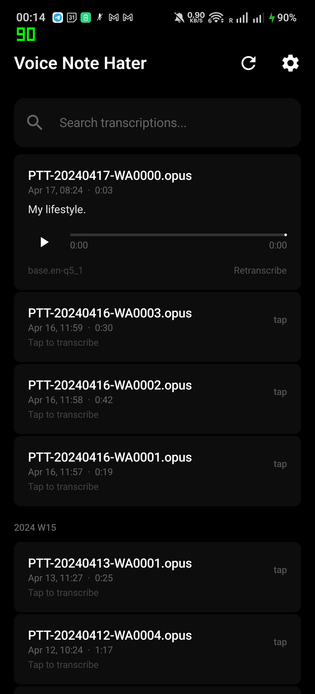
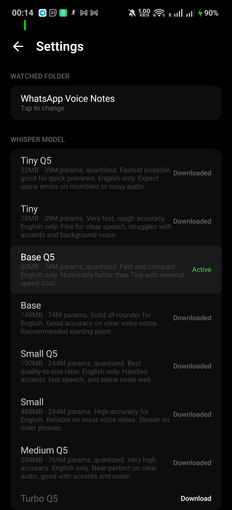
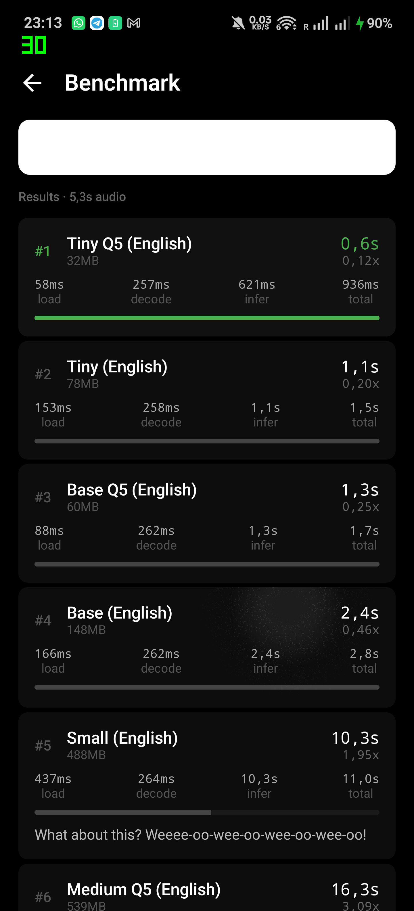

# Voice Note Hater

Because nobody has time to listen.

An Android app that transcribes WhatsApp voice notes locally on your device. No cloud. No account. No internet required.

## What it does

- Transcribes WhatsApp voice notes using [whisper.cpp](https://github.com/ggerganov/whisper.cpp) running entirely on-device
- Auto-detects new incoming voice notes and transcribes them in the background
- Identifies who sent each voice note from WhatsApp notifications
- Streams transcription text as it's being processed
- Highlights words in sync during audio playback
- Supports multiple whisper models — from 32MB (fast) to 874MB (best quality)

## Screenshots

<p align="center">
  
  
  
</p>

## Features

**Transcription**
- Tap any voice note to transcribe it on-demand
- Streaming text — watch words appear as whisper processes
- Timed word highlighting during audio playback
- Long-press to copy full transcription

**Auto-transcribe**
- Detects incoming voice notes via Android's NotificationListenerService
- Captures sender name from WhatsApp notifications (DMs and groups)
- Auto-transcribes new voice notes and shows result as a notification
- Zero battery impact when idle — only wakes on WhatsApp notification

**Models**
- Download models in-app from HuggingFace
- 9 models available: Tiny Q5 (32MB) through Turbo Q8 (874MB)
- Built-in benchmark to compare speed/quality on your device
- Retranscribe any voice note with a different model to compare
- Each transcription records which model produced it

**Audio**
- Built-in audio player with progress bar
- Opus decoding via Android MediaCodec
- Resampling to 16kHz mono for whisper input

## Requirements

- Android 8.0+ (API 26)
- arm64-v8a device (covers 99%+ of modern Android phones)
- ~150MB minimum for the Base model, more for larger models
- WhatsApp installed with voice notes accessible via Storage Access Framework

## Building

```bash
export ANDROID_HOME=/opt/homebrew/share/android-commandlinetools  # or your SDK path
./gradlew assembleDebug
adb install -r app/build/outputs/apk/debug/app-debug.apk
```

See [CLAUDE.md](CLAUDE.md) for detailed development guide including native lib rebuilding, DB migrations, and debugging.

## Tech Stack

| Layer | Choice |
|---|---|
| Language | Kotlin |
| UI | Jetpack Compose |
| Architecture | MVVM + Repository |
| DI | Hilt |
| DB | Room (SQLite) |
| Async | Coroutines + Flow |
| Background | WorkManager + NotificationListenerService |
| Transcription | whisper.cpp via JNI |
| File Access | Storage Access Framework |
| Audio | MediaCodec + MediaExtractor |

## Models

| Model | Size | Speed | Quality | Languages |
|---|---|---|---|---|
| Tiny Q5 | 32MB | ~8x realtime | Fair | English |
| Base | 148MB | ~2x realtime | Good | English |
| Small Q5 | 190MB | ~1.5x realtime | High | English |
| Small | 488MB | ~1x realtime | High | English |
| Turbo Q5 | 574MB | ~0.5x realtime | Excellent | All |
| Turbo Q8 | 874MB | ~0.4x realtime | Best | All |

Speed measured on a mid-range 2024 Android phone (8 cores). Your results will vary — use the built-in benchmark.

## How it works

1. **First launch** — grant folder access to WhatsApp Voice Notes via Android's folder picker
2. **Scan** — indexes `.opus` files from WhatsApp's `YYYYWW/PTT-YYYYMMDD-WANNNN.opus` structure
3. **Transcribe** — decodes opus to PCM, resamples to 16kHz mono, runs whisper.cpp inference
4. **Auto-detect** — NotificationListenerService catches WhatsApp voice message notifications, extracts sender name, triggers background transcription
5. **Results** — transcription stored in Room DB with timed segments for word-level playback highlighting

## License

Private project.
